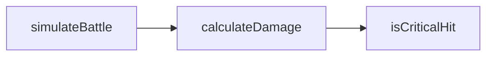

# Realize: Dependency Graph

# 왜 필요한가요?

realize는 한 번에 하나의 imagine 선언을 하나의 세션([61 문서](61-realize-realizer.ko.md) 참조)으로 구현합니다.
그런데 imagine 선언은 다른 imagine 선언을 사용할 수 있으므로, realize 엔진은
**어떤 선언부터 구현해야 할지**를 알아야 합니다.

예를 들어, 다음과 같은 두 imagine 선언이 있다고 합시다:

```typescript chz
/// battle.chz.ts (발췌)

imagine function isCriticalHit(attacker: CombatStats): boolean {
  requirements(`
    # 공격자의 스탯을 기반으로 이번 공격이 크리티컬인지 판정하십시오.
    - attacker.luck(0~100)이 높을수록 크리티컬 확률이 높아야 합니다.
  `);
  ensure(
    typeof isCriticalHit({ attack: 10, defense: 5, luck: 100 }) === "boolean",
    "크리티컬 판정은 boolean을 반환합니다.",
  );
}

imagine function calculateDamage(attacker: CombatStats, defender: CombatStats): number {
  requirements(`
    # 공격자와 방어자의 스탯을 기반으로 최종 데미지를 계산하십시오.
    - 크리티컬 여부는 \`isCriticalHit\`를 사용하여 판정하고,
      크리티컬이면 최종 데미지를 2배로 적용하십시오.
  `);
  ensure("최종 데미지는 음이 아닌 정수입니다.", () => {
    const damage = calculateDamage(
      { attack: 10, defense: 5, luck: 0 },
      { attack: 5, defense: 5, luck: 0 },
    );
    assert(Number.isInteger(damage));
    assert(damage >= 0);
  });
}
```

여기서 `calculateDamage`를 먼저 realize하려고 하면 두 가지 문제가 생깁니다:

1. **컨텍스트가 없습니다.** requirements가 `isCriticalHit`를 사용하라고 지시하지만,
   아직 그 함수의 구현도, realize가 emit한 타입 정의도, `ASSUMPTION:` 주석도
   존재하지 않습니다. LLM은 존재하지 않는 코드 위에 구현을 쌓아야 합니다.
2. **검증할 수 없습니다.** `calculateDamage`의 유닛 테스트를 실행하면 `isCriticalHit`가
   실제로 호출됩니다. 구현이 없으므로 테스트는 실패하는 것이 아니라 **컴파일조차
   되지 않습니다.** realize의 완료 조건이 '테스트 green'인 이상([60 문서](60-realize-intro.ko.md) 참조),
   의존 대상이 먼저 완성되어 있어야 합니다.

이처럼 "A를 구현하려면 B가 먼저 필요하다"는 관계를 **의존성**이라고 부르며,
모든 imagine 선언의 의존성을 방향 그래프로 관리한 것이 **의존성 그래프
(Dependency Graph)**입니다.

# 의존성 그래프의 구성: 노드와 엣지 (간선)

- **노드(Node)**: imagine 선언(함수, 클래스, 모듈, 리소스)을 나타냅니다. 각 노드는
  해당 선언의 이름과 시그니처, 그리고 requirements/ensure의 해시를 가집니다.
  이 해시는 재실행 판정(후술)에 사용됩니다.
- **엣지(Edge)**: 의존 관계를 나타냅니다. imagine 선언 A가 B를 필요로 하면,
  A에서 B로 향하는 방향성 있는 엣지(A → B)가 생성됩니다.

사람이 직접 작성한 코드(타입 정의, 배선 코드)는 realize 대상이 아니므로 realize
순서 결정에는 참여하지 않습니다. 다만 imagine 선언이 사람 소유 타입을 참조하는
경우, 그 참조는 재실행 판정에 반영됩니다(후술).

## 엣지는 어떻게 발견하나요?

여기에는 미묘한 문제가 하나 있습니다. "A가 B를 호출하면 엣지가 생긴다"고 했지만,
**A는 아직 구현이 없습니다.** 존재하지 않는 코드에서 호출 관계를 읽을 수는
없으므로, 엣지는 다음 네 가지 출처에서 단계적으로 수집됩니다:

1. **시그니처의 타입 참조** — A의 시그니처가 참조하는 타입이 다른 imagine
   선언이거나 그 산출물이라면, 확실한 엣지입니다.
2. **ensure의 실행 코드** — `ensure` 안에 적은 식은 실제로 실행되는 코드이므로,
   거기서 다른 imagine 심볼을 호출하면 엣지가 됩니다.
3. **requirements의 자연어 언급** — 위 예시처럼 requirements가 `isCriticalHit`를
   사용하라고 글로 지시했다면, 그 문장에서 이름을 찾아 엣지로 등록합니다.
4. **realize 산출물의 실제 사용** — 세션이 끝난 뒤, emit된 구현에서 import와
   호출을 추출하여 **확정 엣지**로 등록합니다. LLM이 세션 도중 (requirements에
   명시되지 않았더라도) 다른 imagine 심볼을 사용하기로 스스로 결정할 수 있으므로,
   그래프는 realize가 진행될수록 정밀해집니다.

1과 2는 **코드**이므로 [21 문서](21-compiler-preflight.ko.md)의 분석 결과에서
읽습니다. 이름이 같은지가 아니라 **실제로 같은 것을 가리키는지**를 봅니다.
그래서 다른 이름으로 바꿔 부른 import(alias), 안쪽에서 같은 이름을 다시 선언한
지역 변수, 우연히 같은 이름을 쓰는 객체의 속성은 가짜 엣지를 만들지 않습니다.

3만 글자를 찾는 방식입니다. 자연어에는 문법 구조가 없으니 다른 방법이
없습니다 — `isCriticalHit를`, `isCriticalHit가`처럼 조사가 붙은 형태까지
찾아야 하고요. 이것은 **코드 분석을 대신하는 수단이 아니라, 이름이 붙은 별개의
분석 단계**입니다. 각 엣지에는 넷 중 무엇이 발견했는지가 함께 기록됩니다.

첫 realize에서는 1~3으로 만든 **추정 그래프**로 순서를 정하고, 이후의
재실행부터는 4의 확정 엣지가 **추정 그래프에 합류하여** 순서를 함께 구속합니다.
언급 기반 추정 엣지도 계속 유지됩니다 — ensure 하네스의 import가 이 추정으로
결정되므로, 언급 엣지를 버리면 하네스가 realize 순서보다 앞서 다른 심볼을
import하는 모순이 생길 수 있기 때문입니다. (스펙이 변경된 심볼의 옛 확정
엣지는 신뢰하지 않습니다.)

엣지 발견은 **파일 경계를 넘어서도 동일하게** 동작합니다. 다른 치즈 파일의
심볼 사용은 shim 경로 import — 예: `import { ShootingGame } from './example'`
([20 문서](20-module-resolution.ko.md) 참조) — 로 드러나므로, 위 1~4의
출처에 그대로 포착됩니다. 파일 경계를 넘는 엣지는 상대 파일이 어디인지까지
함께 `realization-cache.json`에 기록됩니다.

# Realize 순서

의존성 그래프에 **위상 정렬(topological sort)**을 수행하여, 의존이 없는 노드
(leaf)부터 realize합니다. 위 예시에 `calculateDamage`를 사용하는
`simulateBattle`이 하나 더 있다면:



realize 순서는 화살표의 역순, 즉 `isCriticalHit` → `calculateDamage` →
`simulateBattle`이 됩니다.

- 각 세션이 시작될 때, **이미 realize된 의존 심볼의 산출물**(타입 정의, 구현,
  `ASSUMPTION:` 주석)이 세션의 읽기 가능 범위에 포함됩니다(61 문서의 Realizer
  참조). LLM은 의존 대상이 실제로 어떻게 구현되었는지 확인하면서 그 위에 구현을
  쌓을 수 있습니다.
- 어떤 심볼의 realize가 실패(테스트 red)하면, 그 심볼에 의존하는 나머지 심볼들의
  realize는 진행하지 않습니다. 잘못된 토대 위에 구현을 쌓지 않기 위함입니다.

## 잠깐! 그런데 서로가 서로를 의존하면요? (순환 참조)

순환이 있으면 위상 정렬이 불가능하므로, 별도 규칙이 필요합니다:

- 순환에 속한 노드들(강한 연결 요소, SCC)을 **하나의 그룹으로 묶어**, 해당 그룹을
  한 세션의 단위로 보고 함께 realize합니다. 그룹 전체의 테스트가 green이어야 그룹이
  완료됩니다.
- 단, 그룹이 커질수록 한 세션에서 다뤄야 하는 스펙의 양이 많아져, LLM이 제대로
  처리하지 못하거나 환각을 일으킬 위험이 커집니다. 따라서 realize 단계에서 순환을
  감지하면 **경고를 출력**하며, 그룹 크기가 상한(설정 가능)을 넘으면 에러로
  처리합니다.
- 순환은 대개 설계 신호이기도 합니다. 순환하는 선언들이 공유하는 개념을 **사람
  소유의 인터페이스로 추출**하면, 양쪽이 그 인터페이스에 의존하게 되어 순환이
  끊어집니다 — 사람 소유 타입은 그래프의 노드가 아니기 때문입니다.
- 단, **파일 경계를 넘는 순환**(A 파일의 심볼과 B 파일의 심볼이 서로 의존)은
  v0에서는 그룹으로 묶지 않고 **에러로 처리합니다.** 산출물과 캐시가 여러
  realization 디렉토리에 걸치게 되어 아직 다루지 않기 때문입니다. 해결 방법은
  같습니다 — 공유 개념을 사람 소유 인터페이스로 추출해 순환을 끊으십시오.

# 재실행 가능성

realize는 한 번 실행하고 끝나는 과정이 아닙니다. imagine 선언이 추가·변경될 때마다
반복 실행되며, 이때 전체를 다시 생성하는 것이 아니라 **의존성 그래프를 다시 계산한
뒤 필요한 부분만** realize합니다.

- **변경 감지는 해시 비교로 수행합니다.** 각 노드의 시그니처 + requirements +
  ensure의 해시를 `realization-cache.json`(60 문서 참조)에 기록된 값과 비교하여,
  일치하는 심볼은 재실행하지 않고 건너뜁니다.
- **무효화는 엣지의 역방향으로 전파되며, 전파 여부는 '공개 표면'의 변경 여부로
  결정됩니다.** A → B(A가 B에 의존)에서 B의 선언이 변경되면 B는 무효화되어
  재-realize 대상이 됩니다. 이때 B에 의존하는 A까지 무효화할지는 B의 **공개 표면
  (public surface)** — 시그니처와 ensure 계약 — 이 바뀌었는지로 판단합니다:
  - **공개 표면이 바뀐 경우**: A도 무효화됩니다. 전파는 재귀적이되, **각 홉에서
    같은 기준을 다시 적용합니다**: 재-realize된 A의 공개 표면이 (A의 선언은
    그대로이므로) 변하지 않았다면, A에 의존하는 심볼은 무효화 대신 아래의
    테스트 재실행 안전망을 탑니다.
  - **requirements 등 내부만 바뀐 경우**: A는 재-realize하지 않고 전파를
    중단합니다. 대신 안전망으로, B의 새 구현이 반영된 상태에서 **A의 테스트를
    재실행**합니다. 테스트 재실행에는 LLM 호출이 없으므로 비용이 낮습니다. 이
    테스트가 red가 되면 — B의 동작 변화가 A의 전제를 깨뜨렸다는 뜻이므로 —
    그때 A를 무효화하고 전파를 재개합니다.
- **전파는 파일 경계를 넘습니다.** 그래프는 파일이 아니라 심볼 단위이므로, 파일
  B의 imagine 선언이 파일 A의 선언에 의존하는 '바깥 의존성'도 동일한 규칙으로
  추적·전파됩니다.
- **사람 코드의 변경도 무효화를 일으킬 수 있습니다.** imagine 선언의 시그니처가
  참조하는 사람 소유 타입이 변경되면, 그 선언부터 시작해 동일하게 전파됩니다.

재-realize 대상이 된 심볼에 `@chz-realize-override`가 있는 경우의 보존 규칙은
60 문서를 따릅니다.

## `--reroll` — 스펙은 그대로 두고 다시 뽑기

위의 규칙은 전부 "무엇이 바뀌었는가"에서 출발합니다. 그런데 **아무것도 바뀌지
않았지만 결과가 마음에 들지 않는 경우**가 있습니다. 계약은 만족했고 테스트도
green인데 구현이 장황하거나, 접근이 마음에 안 드는 경우입니다. LLM은 확률적이라
같은 스펙으로 다시 돌리면 다른 산출물이 나옵니다.

```console
$ chz realize game.chz.ts --reroll=checkCollision2D
```

- `--reroll`(값 없음)은 그 파일의 모든 심볼, `--reroll=<a,b>`는 이름을 댄
  심볼만 대상으로 합니다. 값 없는 형태를 불리언으로 둔 것은
  `chz realize --reroll game.chz.ts`에서 뒤의 인자가 소스 파일로 읽혀야 하기
  때문입니다.
- 하는 일은 **재사용 억제 하나뿐입니다.** 스펙도, 사람 코드도, 다른 심볼의
  캐시 엔트리도 건드리지 않습니다. 대상 심볼만 세션을 다시 열고, 나머지는
  평소대로 캐시에서 재사용됩니다.
- **하류 의존자는 재-realize되지 않습니다.** 스펙이 그대로이므로 공개 표면도
  그대로이고, 위의 per-hop 규칙에 따라 하류는 '내부만 바뀐 경우'로 분류되어
  **LLM 없는 테스트 재실행 안전망**만 탑니다. 리롤 하나에 프로젝트 절반을
  다시 생성하는 일은 일어나지 않습니다.
- 이전 산출물은 **그대로 덮어씁니다.** realize 산출물은 커밋되는 것이 원칙이라
  (60 문서) git이 이미 이전 판을 갖고 있고, 마음에 안 들면 `git checkout`으로
  돌아가면 됩니다. chz가 별도의 백업 디렉토리를 두면 git과 역할이 겹칩니다.
- 존재하지 않는 이름을 대면 **세션이 하나도 열리기 전에** 실패하고, 알려진
  심볼 목록을 함께 출력합니다. 오타 하나에 토큰을 쓰지 않기 위해서입니다.
